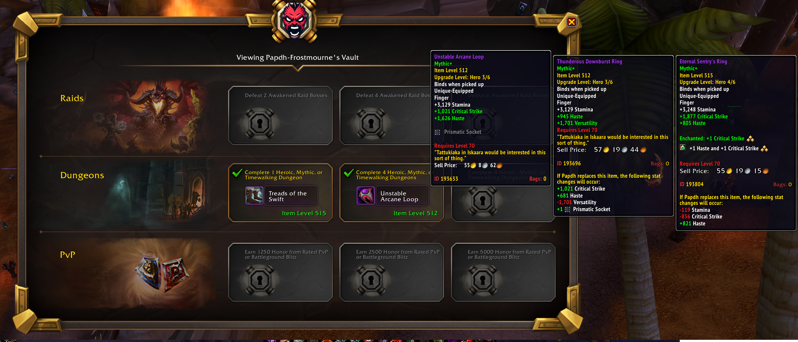

# ReVault Addon

ReVault is a World of Warcraft addon designed to share the contents of your Great Vault with other players (gloat to your guildies). For those looking for more practical use, it’s also perfect for seeking advice on which reward to choose. This addon displays the potential rewards you can choose from your vault and shows the current items you have equipped for easy comparison.

## Usage

1. **Generate a Link to Your Vault:** Click the "Share with ReVault" button in your Great Vault or type /rv to generate a link to your vault.
2. **Share Your Vault Contents:** Shift+click the link and share it in chat as you would any other in-game link.
3. **???** 
4. **Profit:** Others with the addon will be able to open the link to view the rewards in your Great Vault, and your current gear that each reward would replace.

<i>Click the "Share with ReVault" button in your Great Vault to generate a link to your vault.</i>

<i>Or type /rv</i>

<i>Others with the addon will be able to open the link to view the rewards in your Great Vault, and your current gear that each reward would replace.</i>
